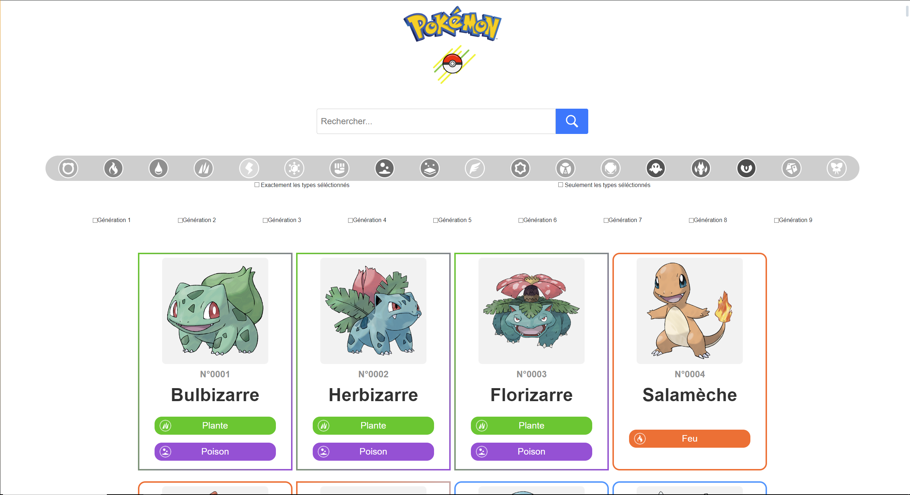
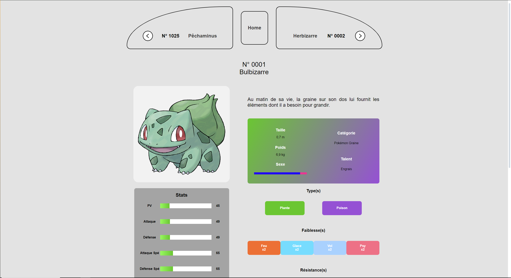

# Pokedex

    

This **pokedex** allows you to see informations about most of the pokemons using online API like Tyradex.tech and PokeAPI.co.

## Features

- Simple and intuitive UI

- Search across the 1025 pokemons by their id or name in real time

- Filter pokemons by their types or generation

- Show precise details like the pokemon's weight, height, sexe ratio, category and abilitie(s)

- Show the pokemon's stats

- Show the pokemon's weaknesses and resistances

- Show the pokemon's evolutions

> **Note**:  There is no mega evolutions and forms.   Filters are not cumulative.

## API

**Tyradex.tech** is a french pokemon API that I used over PokeAPI.co. Here's why:

- All the data is in french (and i'm French ^^)

- Data is more concise and easier to process for my case

- No need to use severals endpoints to acces at specific informations

For my case, I just needed tu call this API with these calls :

- *https://tyradex.tech/api/v1/pokemon* To get the list of all pokemons

- *https://tyradex.tech/api/v1/pokemon/{id}* With id the pokemon's name or pokedex id to get all the information about the pokemon

Even if I used Tyradex.co for 99% of my website, I sill used PokeAPI.co for one call :

- *https://pokeapi.co/api/v2/pokemon-species/{id}* To get the description of a pokemon in French

## What does it look like

